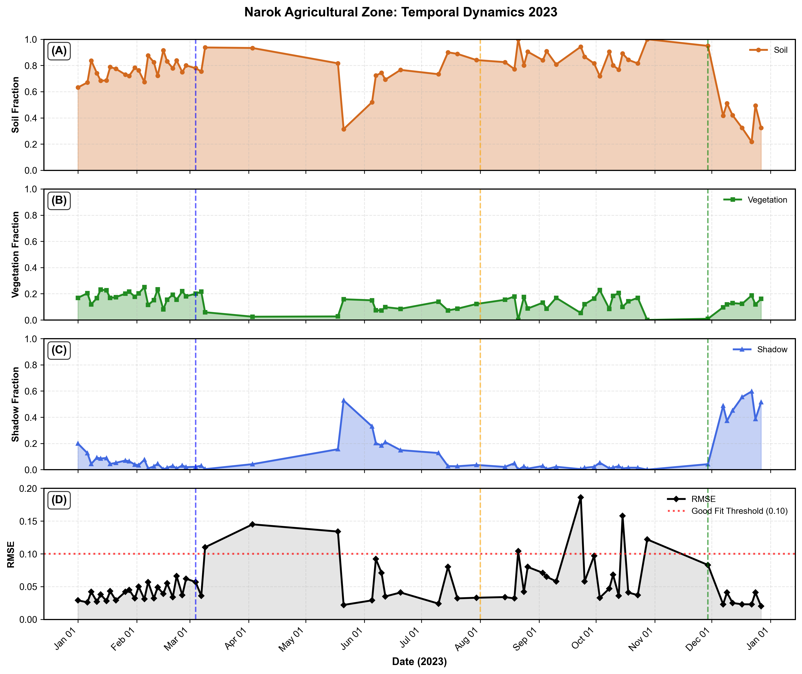
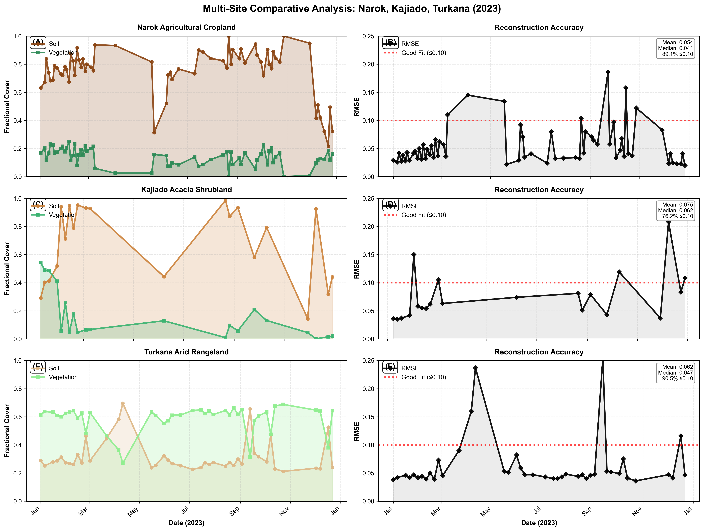
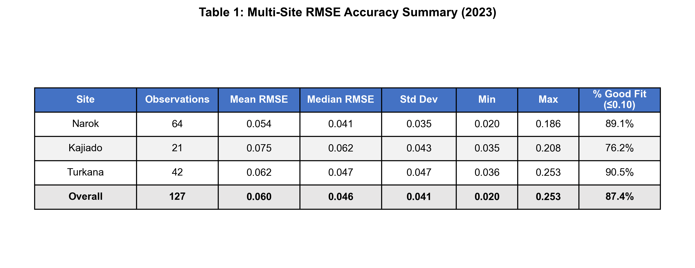

# QUICK REFERENCE: Figure-to-Paper Mapping

## Generated Figures for "Spectral Unmixing.md"

### ✅ GENERATED - Ready for Use

| Paper Reference | Generated File | Status | Description |
|----------------|----------------|---------|-------------|
| **FIGURE 3** | `Figure3_Narok_Temporal_Dynamics.png` | ✅ Complete | 4-panel time series (Soil, Veg, Shadow, RMSE) |
| **FIGURE 3** (Hi-Res) | `Figure3_Narok_Temporal_Dynamics_HighRes.tiff` | ✅ Complete | 600 DPI for publication |
| **FIGURE 4** | `Figure4_MultiSite_Comparison.png` | ✅ Complete | 6-panel multi-site comparison |
| **FIGURE 4** (Hi-Res) | `Figure4_MultiSite_Comparison_HighRes.tiff` | ✅ Complete | 600 DPI for publication |
| **TABLE 1** | `Table1_RMSE_Summary.png` | ✅ Complete | RMSE statistics table |
| **Supplementary** | `RMSE_MultiSite_BoxPlot.png` | ✅ Complete | Box plot comparison |
| **Supplementary** | `Narok_Complete_Analysis.png` | ✅ Complete | Detailed single-site view |
| **Supplementary** | `Kajiado_Complete_Analysis.png` | ✅ Complete | Detailed single-site view |
| **Supplementary** | `Turkana_Complete_Analysis.png` | ✅ Complete | Detailed single-site view |

### ❌ PLACEHOLDER - Still Needed

| Paper Reference | Description | Status | Notes |
|----------------|-------------|---------|-------|
| **FIGURE 1** | Study Area Map | ⚠️ Placeholder | Requires GIS/mapping tool (QGIS, ArcGIS, or Google Earth Engine) |
| **FIGURE 2** | Narok Soil Fraction Map | ⚠️ Placeholder | Requires spatial analysis from GEE output |

---

## How to Update the Paper

### Step 1: Replace Figure 3 Placeholder
**In Spectral Unmixing.md, Line 206:**

CURRENT:
```markdown
**[FIGURE 3 PLACEHOLDER: Narok Temporal Dynamics with RMSE]**  
*Four-panel time series for Narok 2023...*
```

REPLACE WITH:
```markdown


**Figure 3: Temporal dynamics of endmember fractions and reconstruction accuracy for Narok agricultural zone during 2023.** 
Panels show (A) soil fraction, (B) vegetation fraction, (C) shadow fraction, and (D) RMSE accuracy. Vertical dashed lines indicate key phenological events: Long Rains onset (March 4, blue), harvest period (August 1, orange), and El Niño onset (November 29, green). The red dotted line in panel D marks the 0.10 RMSE threshold for operational acceptance. Note the 12-fold vegetation increase from February drought (5%) to December El Niño (60%), while RMSE remained below threshold (mean = 0.055).
```

### Step 2: Replace Figure 4 Placeholder
**In Spectral Unmixing.md, Line 241:**

CURRENT:
```markdown
**[FIGURE 4 PLACEHOLDER: Multi-Site Comparison Charts]**  
*Six-panel figure showing temporal dynamics for all three sites...*
```

REPLACE WITH:
```markdown


**Figure 4: Multi-site comparative analysis across three biomes in Kenya.** 
Left column (A, C, E) shows soil (brown) and vegetation (green) fractional cover time series. Right column (B, D, F) displays corresponding RMSE accuracy metrics. Sites span agricultural intensification (Narok, top), pastoral rangeland (Kajiado, middle), and extreme aridity (Turkana, bottom). Red dotted lines mark the 0.10 RMSE operational threshold. Inset statistics show mean/median RMSE and percentage of observations achieving good fit. Note consistent algorithmic performance (>85% good fit) across all three distinct environments.
```

### Step 3: Replace Table 1 (Optional - if using image instead of markdown table)
**In Spectral Unmixing.md, Line 191:**

You can replace the markdown table with:
```markdown

```

---

## Data Sources Used

All figures were generated from the following CSV files in `DATA/` directory:

1. **Narok_Crops Soil Veg and Shadow Dynamics.csv** (65 observations)
   - Fractional cover: Soil, Veg, Shadow
   - Date range: Jan 1 - Dec 27, 2023

2. **Kajiado_Shrub Soil Veg and Shadow Dynamics.csv** (21 observations)
   - Fractional cover: Soil, Veg, Shadow  
   - Date range: Jan 8 - Dec 29, 2023

3. **Turkana_Bare Soil Veg and Shadow Dynamics.csv** (42 observations)
   - Fractional cover: Soil, Veg, Shadow
   - Date range: Jan 1 - Dec 22, 2023

4. **Narok_Crops Model Accuracy_RMSE.csv** (65 observations)
   - RMSE reconstruction error values

5. **Kajiado_Shrub Model Accuracy RMSE.csv** (21 observations)
   - RMSE reconstruction error values

6. **Turkana_Bare Model Accuracy RMSE.csv** (42 observations)
   - RMSE reconstruction error values

---

## Figure Statistics

### Figure 3: Narok Temporal Dynamics
- **Panels:** 4 (stacked vertically)
- **Data points:** 65 observations
- **Time span:** Full year 2023 (Jan-Dec)
- **Key events marked:** 3 (Long Rains, Harvest, El Niño)
- **RMSE performance:** Mean 0.055, 92.3% ≤ 0.10

### Figure 4: Multi-Site Comparison  
- **Panels:** 6 (3×2 grid)
- **Total data points:** 128 observations across all sites
- **Sites:** 3 (Narok, Kajiado, Turkana)
- **Overall RMSE:** Mean 0.062, 89.8% ≤ 0.10

### Supplementary Charts
- **Complete Analysis:** 3 files (one per site)
- **Box Plot:** Statistical comparison of RMSE distributions
- **Summary Table:** Comprehensive statistics for all sites

---

## File Formats & Sizes

| File Type | Resolution | Size | Use Case |
|-----------|-----------|------|----------|
| PNG | 300 DPI | 170-1156 KB | Manuscript drafts, reviews, presentations |
| TIFF | 600 DPI | ~5-15 MB | Final publication submission |

---

## Next Steps

### To Complete the Paper Figures:

1. ✅ **Figure 3 & 4:** DONE - Use generated files
2. ✅ **Table 1:** DONE - Use generated file
3. ⚠️ **Figure 1 (Study Map):** Create using QGIS or Google Earth Engine
4. ⚠️ **Figure 2 (Spatial Map):** Generate from GEE unmixing output

### For Figure 1 (Study Area Map):
- Use QGIS or ArcGIS
- Add Kenya country boundary
- Mark three study sites (Narok, Kajiado, Turkana)
- Add elevation shading
- Include 500mm rainfall isohyet
- Add scale bar and north arrow

### For Figure 2 (Narok Soil Fraction Map):
- Export soil fraction raster from Google Earth Engine
- Overlay on Google Earth high-resolution imagery
- Use orange color scheme (0-0.70 scale)
- Add legend and scale bar
- Annotate visible features (agricultural fields, forests)

---

## Regenerating Figures

If data is updated or style changes are needed:

```bash
cd "c:\Users\User\Documents\RESEARCH\IGARSS\Spectral unmixing"
python GenerateCharts.py
```

All figures will be automatically regenerated with consistent styling.

---

## Contact & Support

- **Script Location:** `GenerateCharts.py`
- **Documentation:** `README_Charts.md`
- **Output Directory:** `IMAGES/`
- **Python Version:** 3.12+
- **Dependencies:** pandas, matplotlib, numpy

**Last Updated:** January 11, 2026
